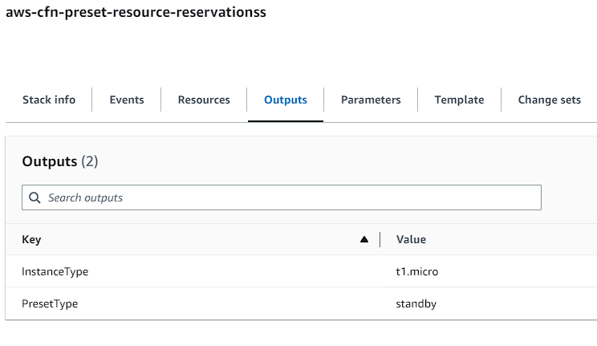
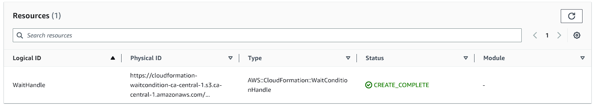

# AWS CloudFormation Presets for Resource Reservations

This is a companion repository for the written article 'Preset Resource Reservations in CloudFormation Templates', which demonstrates examples of CloudFormation Templates which contain preset resource reservations, which are computed by the parameter set provided to a CloudFormation Stack. These CloudFormation Templates are handwritten, but in practice would rely on frameworks such as AWS Cloud Development Kit (CDK) to construct the presets, as a library. If defined as a library function, this would enable partial specifying of a mappings properties, with a node traversal to resolve them at build time.



## Notes

### Why use a `WaitConditionHandle`

A `WaitConditionHandle` was chosen over a common resource type like [AWS::IAM::Role](https://docs.aws.amazon.com/AWSCloudFormation/latest/UserGuide/aws-resource-iam-role.html) because the CloudFormation Template is solely focused on the `FindInMap` and `Mapping` functionality. Using a `WaitConditionHandle` does introduce complexity because it doesn't support an `update` action, which is why the repository generates a random logical ID for this `WaitConditionHandle` to force updates. Using a resource like [AWS::IAM::Role](https://docs.aws.amazon.com/AWSCloudFormation/latest/UserGuide/aws-resource-iam-role.html) has the potential to avoid that, but ultiamtely means introducing another Amazon Web Service (AWS) service like IAM into the mix.



### Why randomize the `WaitConditionHandle` logical ID

The logical ID for this needs to be randomized to ensure that each deployment of the CloudFormation stack will cause an update operation. Otherwise CloudFormation will not trigger updates non-resource changes. That means that if just the `Parameters` and `Outputs` are changing, CloudFormation will not trigger an update.

You can learn a bit on this from [Amazon CloudFormation stack updates](https://docs.amazonaws.cn/en_us/AWSCloudFormation/latest/UserGuide/using-cfn-updating-stacks.html) or [How does Amazon CloudFormation work?](https://docs.amazonaws.cn/en_us/AWSCloudFormation/latest/UserGuide/cfn-whatis-howdoesitwork.html).

### Why handcraft the templates

The templates in this repository are handcrafted instead of being generated by something like [AWS CDK](https://aws.amazon.com/cdk/) (or cloudformation spec libraries like [cloudtools/troposphere](https://github.com/cloudtools/troposphere), as this was intended to focus more on the underlying capabilities of CloudFormation, rather than the interface you might define for encoding this kind of presets within a framework like AWS CDK.

As an example, when constructing these mappings & resources within AWS CDK, you might want to encode it as YAML/JSON files that are loaded in at build time. As depending on your use case, this may make it a lot easier to scan your entire codebase to find any invalid instance types (or suboptimal), or services that cannot scale to zero. If its encoded within one of the AWS CDK languages, you'd need to rely on either `grep/sed/awk` or understand the programming language. If the templates are encoded with a reference identifier, like in the metadata, this could make it might easier to associate the live profiling recommendations with the specifications in code. E.g.:

```yaml
Metadata:
  ReferenceID:
    Description: 8505a4ec-4d78-4983-9dd8-37451358f674
```

This would then look like the following within the source code:

```yaml
referenceid: 8505a4ec-4d78-4983-9dd8-37451358f674
reservations:
  standby:
    properties:
      - name: InstanceType
        value: t1.micro
  default:
    properties:
      - name: InstanceType
        value: t2.nano
    nodes:
      scaled:
        properties:
          - name: InstanceType
            value: t2.micro
```

This kind of design decision wasn't the focus on this repository/article, so the templates became handcrafted.
