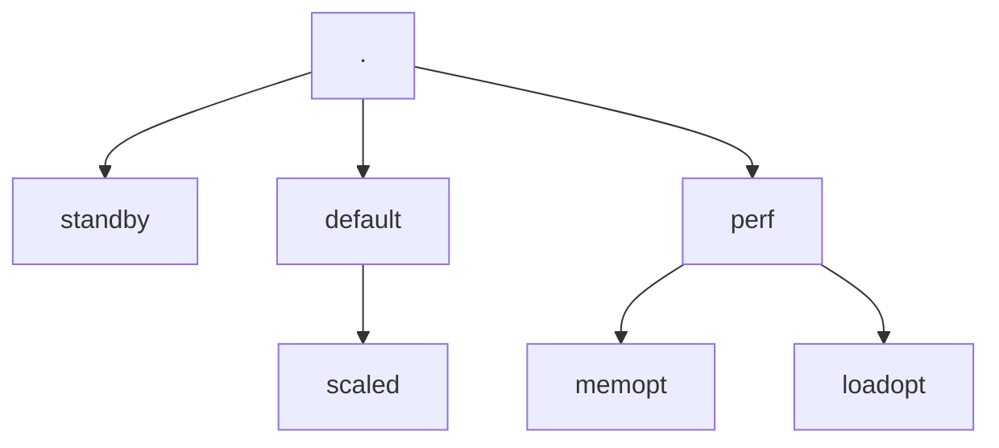

# AWS CloudFormation Presets for Resource Reservations

This is a companion repository for the written article 'Preset Resource Reservations in CloudFormation Templates', which demonstrates examples of CloudFormation Templates which contain preset resource reservations, which are computed by the parameter set provided to a CloudFormation Stack. These CloudFormation Templates are handwritten, but in practice would rely on frameworks such as AWS Cloud Development Kit (CDK) to construct the presets, as a library. If defined as a library function, this would enable partial specifying of a mappings properties, with a node traversal to resolve them at build time.

## Getting Started

For working with the repository, you will need an [Amazon Web Services (AWS)](https://aws.amazon.com/) Account, for which the permissions are sufficient to provision and destory CloudFormation Stacks. For simplicity, both a GitPod and Codespaces container are included with the repository, should you be familiar with those Developer Platform as a Service (DPaaS).

If you are working locally, you will need to ensure that the following tools are installed:

- [make](https://www.gnu.org/software/make/)
- [awscli](https://aws.amazon.com/cli/)

This repository uses `make` as an runner & interface for the CloudFormation commands. It is recommended when entering the repository to run `make help` to see a list of available commands, and the related documentation.

## Deploying into CloudFormation

> Before starting you should make sure you have authenticated to AWS with the [awscli](https://docs.aws.amazon.com/cli/latest/userguide/cli-chap-configure.html)

To initialize an empty CloudFormation Stack that creates no resources, you can run the make command `cfn-init`. This will deploy into CloudFormation a stack that uses a `WaitConditionHandle` as the sole resource. You can run this as follows:

```bash
make cfn-init
```

This will construct a stack with the name `aws-cfn-preset-resource-reservations`, as seen in the command logs:

```text

Waiting for changeset to be created..
Waiting for stack create/update to complete
Successfully created/updated stack - aws-cfn-preset-resource-reservations
```

> You can modify the CloudFormation stack name using the `STACK_NAME` variable

The CloudFormation Template that has been deployed is located at [cloudformation/01-empty/stack.yaml.template](cloudformation/01-empty/stack.yaml.template), which contains just metadata and the `WaitConditionHandle`. Provisioning this allows us to get a working CloudFormation Stack withoutneeding to worry about troubleshooting a failed stack create.

With the stack created, you can now deploy the CloudFormation template that defined with the [preset type mappings](cloudformation/01-empty/stack.yaml.template). You can do this as follows:

```bash
make cfn-mapping
```

This will deploy the cloudformation template, with the `PresetTypeMapping` map, with a default preset type of `standby`, as seen in the command logs:

```text

Waiting for changeset to be created..
Waiting for stack create/update to complete
Successfully created/updated stack - aws-cfn-preset-resource-reservations
[
    {
        "OutputKey": "InstanceType",
        "OutputValue": "t1.micro",
        "Description": "The 'InstanceType' from the presets, as defined by `PresetType`"
    },
    {
        "OutputKey": "PresetType",
        "OutputValue": "standby",
        "Description": "The value of the Parameter 'PresetType'"
    }
]
```

The `PresetTypeMapping` within the CloudFormation Template encodes the following tree as a dictionary:



The `PresetType` field can be modified using the `PARAMETERS` variable passed to make. You can do this as follows:

```bash
make PARAMETERS="PresetType=perf.memopt" cfn-mapping
```

This will select from the `PresetTypeMapping` mapping the value of `t2.medium` from that node, as seen in the command logs:

```text
Deploying with parameter overrides: PresetType=perf.memopt


Waiting for changeset to be created..
Waiting for stack create/update to complete
Successfully created/updated stack - aws-cfn-preset-resource-reservations
[
    {
        "OutputKey": "InstanceType",
        "OutputValue": "t2.medium",
        "Description": "The 'InstanceType' from the presets, as defined by `PresetType`"
    },
    {
        "OutputKey": "PresetType",
        "OutputValue": "perf.memopt",
        "Description": "The value of the Parameter 'PresetType'"
    }
]
```

## Overriding Preset Mappings

Should it be desired to override the presets, the previous CloudFormation Template does not support this, as it only uses mapping for values. The override functionality has been added into the CloudFormation Template [cloudformation/03-overrides/stack.yaml.template](cloudformation/03-overrides/stack.yaml.template), which uses conditions to allow overriding the `InstanceType`. 

This override-supporting CloudFormation Template can be deployed as follows:

```bash
make cfn-overrides
```

This template will continue to use the `PresetTypeMapping` for values, as seen in the command logs:

```text


Waiting for changeset to be created..
Waiting for stack create/update to complete
Successfully created/updated stack - aws-cfn-preset-resource-reservations
[
    {
        "OutputKey": "InstanceType",
        "OutputValue": "t2.medium",
        "Description": "The 'InstanceType' from the presets, unless overwritten by the parameter 'InstanceType'"
    },
    {
        "OutputKey": "PresetType",
        "OutputValue": "perf.memopt",
        "Description": "The value of the Parameter 'PresetType'"
    }
]
```

The instance type can then be overwritten by specifying the `InstanceType` parameter, like as follows:

```bash
make PARAMETERS="InstanceType=t2.large" cfn-overrides
```

This will override the template to rely on the `InstanceType` parameter value, instead of using the value within the preset mapping, as seen in the command logs:

```text
Deploying with parameter overrides: InstanceType=t2.large


Waiting for changeset to be created..
Waiting for stack create/update to complete
Successfully created/updated stack - aws-cfn-preset-resource-reservations
[
    {
        "OutputKey": "InstanceType",
        "OutputValue": "t2.large",
        "Description": "The 'InstanceType' from the presets, unless overwritten by the parameter 'InstanceType'"
    },
    {
        "OutputKey": "PresetType",
        "OutputValue": "perf.memopt",
        "Description": "The value of the Parameter 'PresetType'"
    }
]
```

It is possible to disable the override, by clearing the parameter value of `InstanceType`, which will see it shift to relying on the preset mapping. You can do that by running:

```bash
make PARAMETERS="InstanceType=''" cfn-overrides
```
